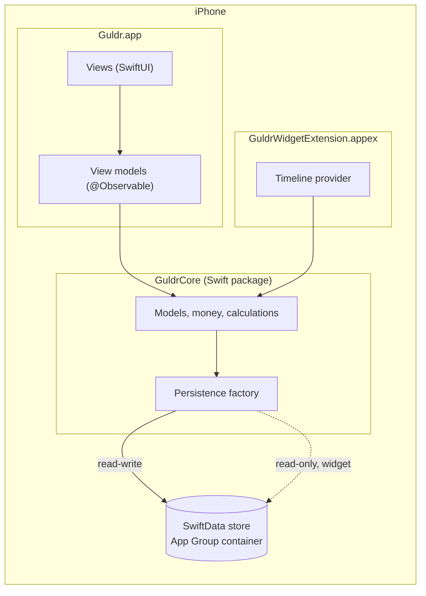

# Architecture

How Guldr is put together: targets, configuration, folder structure and the rules each layer follows. Decisions behind these choices are recorded in [`decisions/`](decisions/).

> Status: foundations only. Sections marked **Planned** describe the agreed design for code that does not exist yet; they are completed as each phase lands.

## Overview



Guldr is local-first: all data lives on the device, in a SwiftData store inside the shared App Group container so the widget can read it ([ADR 007](decisions/007-persistence-and-widget-data.md)). The domain — models, money, calculations — lives in the `GuldrCore` package shared by the app and the widget ([ADR 006](decisions/006-guldr-core-package.md)). There is no backend. iCloud sync is planned for v1.1 and the models are already CloudKit-compatible ([roadmap](ROADMAP.md)).

## Targets

| Target | Product | Bundle ID | Role |
|---|---|---|---|
| `Guldr` | `Guldr.app` | `com.argudev.guldr` | The app |
| `GuldrWidgetExtension` | `GuldrWidgetExtension.appex` (embedded in the app) | `com.argudev.guldr.widget` | Home screen widgets |
| `GuldrTests` | `GuldrTests.xctest` (hosted in the app) | `com.argudev.GuldrTests` | App-hosted tests (Swift Testing) |

| Package | Products | Linked to | Role |
|---|---|---|---|
| `Packages/GuldrCore` | `GuldrCore` library, `GuldrCoreTests` | `Guldr`, `GuldrWidgetExtension` | Domain layer; iOS 26 and macOS 26 (macOS only to run `swift test` without a simulator); Swift 6 with default `nonisolated` isolation |

All app targets: iOS 26.0, iPhone only, Swift 6 language mode, `MainActor` default isolation and Approachable Concurrency ([ADR 001](decisions/001-ios-26-minimum.md), [ADR 003](decisions/003-concurrency-defaults.md)). There is no UI test target; UI is verified with previews and on device.

## Configuration

| What | Where | Notes |
|---|---|---|
| Version, build number, deployment target, App Group ID | [`Config/Shared.xcconfig`](../Config/Shared.xcconfig) | Included by `Debug.xcconfig` and `Release.xcconfig`, assigned at project level. Targets have no overrides. |
| App Group at runtime | Info.plist key `AppGroupID` = `$(APP_GROUP_ID)` | Code reads the group from the bundle instead of hard-coding it; covered by `ConfigurationTests`. |
| Entitlements | `Guldr/Guldr.entitlements`, `GuldrWidgetExtension.entitlements` | App Groups only. iCloud is intentionally absent until v1.1. |
| Secrets | `Config/Secrets.xcconfig` | Gitignored; none needed yet. |

Identifiers are explained in [ADR 002](decisions/002-identifiers.md).

## Folder structure

The app target uses a synchronized folder: every file under `Guldr/` belongs to the app target automatically. Folders are created with their first file; empty placeholders are not committed because Xcode would copy them into the bundle.

```
Guldr/
├── App/                 Entry point, store loading and its error screen, app-wide services
├── Core/
│   ├── DesignSystem/    Typography, spacing and reusable components built on GuldrColors
│   └── Extensions/      Small, generic extensions (formatting, dates)
├── Features/
│   ├── Dashboard/       One folder per feature: views, view model, components
│   ├── Transactions/
│   ├── Budget/
│   ├── Charts/
│   └── Settings/
├── Resources/           Asset catalogs, String Catalog, privacy manifest
├── Info.plist           Stays at the root: referenced by INFOPLIST_FILE
└── Guldr.entitlements   Stays at the root: referenced by CODE_SIGN_ENTITLEMENTS
GuldrWidget/             Widget extension sources and its Info.plist
GuldrTests/              App-hosted tests (only what needs the app bundle)
Packages/GuldrCore/      Domain package (ADR 006)
├── Sources/GuldrCore/
│   ├── Money/           Money, currencies, keypad input, formatting
│   ├── Dates/           YearMonth, day labels
│   ├── Models/          SchemaV1, the @Model types, default categories and their seeder
│   └── Persistence/     PersistenceController, PersistenceError, PreviewData
└── Tests/GuldrCoreTests/ Mirrors Sources
Config/                  xcconfig files
docs/                    Design, decisions, workflow, roadmap and setup runbook
```

Present today: `App/`, `Resources/`, `Info.plist`, `Guldr.entitlements`. The rest appears as the features are built. Models and persistence live in `GuldrCore`, not in the app target, so the widget and `swift test` share them.

## Layers

### Views
SwiftUI only. Views render state and forward user intent; they hold no business logic. Native components first (`NavigationStack`, `TabView`, sheets, segmented `Picker`), styled with the design system ([DESIGN.md](design/DESIGN.md)). Every view has light and dark previews.

### View models
One `@Observable` final class per screen, owned by the view with `@State`. They expose display-ready values and actions, and depend on the data layer through protocols so they can be tested with in-memory stores or fakes. Main-actor isolated by default.

### Data
Everything about the store lives in `GuldrCore` ([ADR 007](decisions/007-persistence-and-widget-data.md)).

- **Models:** `Transaction`, `Category` and `Budget`, declared in `SchemaV1` (a `VersionedSchema`) with a `GuldrMigrationPlan` that is empty until the first change. Top-level aliases point at the current version. They stay CloudKit-compatible: no `@Attribute(.unique)`, optional relationships with inverses, a default for every property, only plain stored types. Amounts are `Int64` minor units plus `currencyCode`, exposed as `Money` ([ADR 005](decisions/005-money-representation.md)); enums are stored as raw strings behind computed properties; `Budget.yearMonth` is `YearMonth.rawValue` ([ADR 008](decisions/008-categories-and-month-keys.md)). Category colors come from a curated palette ([ADR 009](decisions/009-category-color-palette.md)).
- **Container:** `PersistenceController(mode:)` opens `<App Group>/Library/Application Support/Guldr.store` read-write for the app (`.app`), read-only for the widget (`.widget`), or in memory for tests and previews (`.inMemory`). CloudKit is off (`cloudKitDatabase: .none`). The app and in-memory modes seed the default categories on every open; seeding matches `systemKey`s, so it never duplicates.
- **Errors:** opening throws `PersistenceError`: `appGroupUnavailable`, `storeCreationFailed(underlying:)`, or `storeNotFound` (widget only, before the app's first launch). In the app, `AppDataLoader` turns the result into the app or `StoreErrorView`, a calm screen with a retry and a prefilled support mail. There is no `fatalError` and no silent fallback to an empty store.
- **After saves:** the app calls `DataChangeNotifier.dataDidChange()` (from the environment), the one place that refreshes dependents: widget timelines, and budget notifications from Phase 25.
- **Previews:** `PreviewData.makeController()` returns an in-memory store with April–September 2026 that reproduces the mockups' numbers, with "now" fixed at `PreviewData.referenceDate` (Sept 28, 9:41).

Names: outside `GuldrCore`, `Transaction` collides with SwiftUI's and `Category` with the Objective-C runtime typedef re-exported by Foundation. Client modules declare module-level aliases (`typealias Category = GuldrCore.Category`), which win over imported names.

### Widget — **Planned** (UI in Phase 24)
The plumbing exists: `WidgetStore.open()` calls `PersistenceController.widgetAccess(infoDictionary:)` with the extension's own Info.plist and gets `.ready(container)`, `.noDataYet` or `.unavailable(error)`. The widget shows its empty state for the last two and never writes; SwiftData rejects a save on the read-only store. Timelines will be built with the same `GuldrCore` calculations as the app.

## Concurrency

In the app and the widget, code is main-actor isolated unless it opts out. `GuldrCore` keeps Swift's default `nonisolated` isolation: its value types are `Sendable` and callable from any context. Work that must leave the main actor is explicit: `nonisolated` for value types and helpers callable from anywhere, `@concurrent` for functions that run in the background (CSV export, heavy aggregation). `@unchecked Sendable` is never used without a comment explaining why. See [ADR 003](decisions/003-concurrency-defaults.md).

## Testing and CI

Tests use Swift Testing and in-memory SwiftData containers; persistence tests use a temporary folder as the App Group. Domain tests live in `GuldrCore` and run with `swift test` on macOS (`core-tests` CI job, no simulator, plus strict SwiftLint). The few app-hosted tests run on a pre-booted simulator (`test` job). Both jobs are required and fail if no test ran. Details in [WORKFLOW.md](WORKFLOW.md#testing) and [WORKFLOW.md](WORKFLOW.md#continuous-integration).
